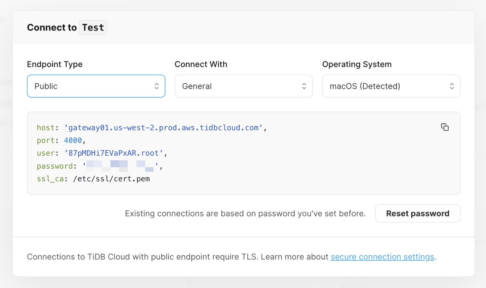

# Connecting to TiDB with ORM framework Prisma

[](https://nodejs.org/en)
[](https://github.com/mysqljs/mysql)

The following guide will show you how to connect to the TiDB cluster with Node.js ORM framework [Prisma](https://www.prisma.io/) and perform basic SQL operations like create, read, update, and delete.

> **💡 Tips:**
>
> TiDB is a MySQL-compatible database, which means you can connect to a TiDB cluster in your application using the familiar driver/ORM framework from the MySQL ecosystem.
>
> The only difference is that if you connect to a TiDB Serverless cluster with public endpoint, you **MUST** [enable TLS connection on Prisma](#4-set-up-the-environment-variables).

## Prerequisites

To complete this guide, you need:

- [Node.js](https://nodejs.org/en) >= 16.x installed on your machine
- [Git](https://git-scm.com/downloads) installed on your machine
- A TiDB cluster running

**If you don't have a TiDB cluster yet, please create one with one of the following methods:**

1. (**Recommend**) [Start up a TiDB Serverless cluster](https://tidbcloud.com/free-trial?utm_source=github&utm_medium=quickstart) instantly with a few clicks on TiDB Cloud.
2. [Start up a TiDB Playground cluster](https://docs.pingcap.com/tidb/stable/quick-start-with-tidb#deploy-a-local-test-cluster) with TiUP CLI on your local machine.

## Getting started

This section demonstrates how to run the sample application code and connect to TiDB with Node.js ORM framework [Prisma](https://www.prisma.io/).

### 1. Clone the repository

Run the following command to clone the sample code locally：

```shell
git clone https://github.com/tidb-samples/tidb-nodejs-prisma-quickstart.git
cd tidb-nodejs-prisma-quickstart
```

### 2. Install dependencies

Run the following command to install the dependencies (including the `prisma` package) required by the sample code：

```shell
npm install
```

<details>
<summary><b>Install dependencies to existing project</b></summary>

For your existing project, run the following command to install the packages:

- `prisma`: The ORM framework for Node.js and TypeScript.
- `typescript`: The TypeScript compiler.
- `ts-node`: The TypeScript execution engine and REPL for Node.js.
- `@types/node`: The TypeScript type definitions for Node.js.

```shell
npm install prisma typescript ts-node @types/node --save-dev
```
</details>

### 3. Obtain connection parameters

<details open>
<summary><b>(Option 1) TiDB Serverless</b></summary>

You can obtain the database connection parameters on [TiDB Cloud's Web Console](https://tidbcloud.com/free-trial?utm_source=github&utm_medium=quickstart) through the following steps:

1. Navigate to the [Clusters](https://tidbcloud.com/console/clusters) page, and then click the name of your target cluster to go to its overview page.
2. Click **Connect** in the upper-right corner.
3. In the connection dialog, select `General` from the **Connect With** dropdown and keep the default setting of the **Endpoint Type** as `Public`.
4. If you have not set a password yet, click **Create password** to generate a random password.
5. Copy the connection parameters shown on the code block.

    <div align="center">
        <picture>
            <source media="(prefers-color-scheme: dark)" srcset="./static/images/tidb-cloud-connect-dialog-dark-theme.png" width="600">
            
        </picture>
        <div><i>The connection dialog of TiDB Serverless</i></div>
    </div>

</details>

<details>
<summary><b>(Option 2) TiDB Dedicated</b></summary>

You can obtain the database connection parameters on [TiDB Cloud's Web Console](https://tidbcloud.com/console) through the following steps:

1. Navigate to the [Clusters](https://tidbcloud.com/console/clusters) page, and then click the name of your target cluster to go to its overview page.
2. Click **Connect** in the upper-right corner. A connection dialog is displayed.
3. Create a traffic filter for the cluster.

   1. Click **Allow Access from Anywhere** to add a new CIDR address rule to allow clients from any IP address to access. 
   2. Click **Create Filter** to confirm the changes.

4. Under **Step 2: Download TiDB cluster CA** in the dialog, click **Download TiDB cluster CA** for TLS connection to TiDB clusters.
5. Under **Step 3: Connect with a SQL client** in the dialog, select `General` from the **Connect With** dropdown and select `Public` from the **Endpoint Type** dropdown.
6. Copy the connection parameters shown on the code block.

</details>

<details>
<summary><b>(Option 3) TiDB Self-Hosted</b></summary>

   Prepare the following connection parameters for your cluster:

  - **host**: The IP address or domain name where the TiDB cluster running (For example: `127.0.0.1`).
  - **port**: The port on which your database server is running (Default: `4000`).
  - **user**: The name of your database user (Default: `root`).
  - **password**: The password of your database user (No password for TiDB Playground by default).

</details>

### 4. Set up the environment variables

In the `prisma/schema.prisma` configuration file, we use the `mysql` database connector as the `provider`, and the environment variable `DATABASE_URL` as the `url` of the data source.

```prisma
generator client {
  provider = "prisma-client-js"
}

datasource db {
  provider = "mysql"
  url      = env("DATABASE_URL")
}
```

Prisma supports loads environment variables from the `.env` file. Please follow the following steps to set up the `DATABASE_URL` environment variable:

<details open>
   <summary><b>(Option 1) TiDB Serverless</b></summary>

   1. Make a copy of the `.env.example` file to the `.env` file.
   2. Edit the `.env` file, and replace the placeholders for `<host>`, `<user>`, and `<password>` with the copied connection parameters.
   3. Add the `sslaccept=strict` parameter to the end of the `DATABASE_URL` value. **(Required for public endpoint)**

   ```dotenv
   DATABASE_URL=mysql://<user>:<password>@<host>:4000/test?sslaccept=strict
   ```

</details>

<details>
   <summary><b>(Option 2) TiDB Dedicated</b></summary>

   1. Make a copy of the `.env.example` file to the `.env` file.
   2. Edit the `.env` file, and replace the placeholders for `<host>`, `<user>`, and `<password>` with the copied connection parameters.
   3. Add `?sslaccept=strict&sslcert=/path/to/ca.pem` to the end of the `DATABASE_URL` value to enable TLS connections with specified CA certificate, which is downloaded in the previous step. **(Recommend for public endpoint)**

   ```dotenv
   DATABASE_URL=mysql://<user>:<password>@<host>:4000/test?sslaccept=strict&sslcert=/path/to/ca.pem
   ```

</details>

<details>
   <summary><b>(Option 3) TiDB Self-Hosted</b></summary>

   1. Make a copy of the `.env.example` file to the `.env` file.
   2. Edit the `.env` file, and replace the placeholders for `<host>`, `<user>`, and `<password>` with the copied connection parameters.

   > Skip the below steps if your cluster doesn't [enable TLS connections](https://docs.pingcap.com/tidb/stable/enable-tls-between-clients-and-servers#configure-tidb-server-to-use-secure-connections), the TiDB Self-Hosted cluster using non-encrypted connection between TiDB's server and clients by default.
   
   3.  Add `?sslaccept=strict&sslcert=/path/to/ca.pem` to the end of the `DATABASE_URL` value to enable TLS connections with specified CA certificate, which is defined with [`ssl-ca`](https://docs.pingcap.com/tidb/stable/tidb-configuration-file#ssl-ca) option.

   ```dotenv
   DATABASE_URL=mysql://<user>:<password>@<host>:4000/test
   ```

</details>

For more information, please check the documentation of [Prisma MySQL connector](https://www.prisma.io/docs/concepts/database-connectors/mysql#connection-details).

### 5. Create the database schema

Run following command to invoke [Prisma Migrate](https://www.prisma.io/docs/concepts/components/prisma-migrate) to initialize the database with the data models defined in [`prisma/prisma.schema`](prisma/schema.prisma).

```shell
npx prisma migrate dev
```

<details>
<summary><b>Data models defined in <code>prisma.schema</code></b></summary>

```prisma
// Define a Player model, which represents the `players` table in the database.
model Player {
  id        Int      @id @default(autoincrement())
  name      String   @unique(map: "uk_player_on_name") @db.VarChar(50)
  coins     Decimal  @default(0)
  goods     Int      @default(0)
  createdAt DateTime @default(now()) @map("created_at")
  profile   Profile?

  @@map("players")
}

// Define a Profile model, which represents the `profiles` table in the database.
model Profile {
  playerId  Int    @id @map("player_id")
  biography String @db.Text

  // Define a 1:1 relation between the `Player` and `Profile` models with Foreign Key constraints.
  player    Player @relation(fields: [playerId], references: [id], onDelete: Cascade, onUpdate: NoAction, map: "fk_profile_on_player_id")

  @@map("profiles")
}
```

</details>

To learn how to define data models in Prisma, please check the [Data model](https://www.prisma.io/docs/concepts/components/prisma-schema/data-model) documentation.

**Expected execution output:**

```
Your database is now in sync with your schema.

✔ Generated Prisma Client (5.1.1 | library) to ./node_modules/@prisma/client in 54ms
```

This command will also generate [Prisma Client](https://www.prisma.io/docs/concepts/components/prisma-client) for TiDB database accessing based on the [`prisma/prisma.schema`](prisma/schema.prisma).

### 6. Run the sample code

Run the following command to execute the sample code:

```shell
npm start
```

**Main steps in the sample code**

The sample code imports the auto-generated `@prisma/client` package and create a new `PrismaClient` instance, and then perform some basic CRUD operations in type-safe way.

```typescript
// Step 1. Import the `@prisma/client` package, which is generated by `npx prisma generate` command.
import {Player, PrismaClient} from '@prisma/client';

async function main(): Promise<void> {
  // Step 2. Create a new `PrismaClient` instance.
  const prisma = new PrismaClient();
  try {

    // Step 3. Perform some CRUD operations with Prisma Client ...
    
  } finally {
    // Step 4. Disconnect Prisma Client.
    await prisma.$disconnect();
  }
}

void main();
```

**Expected execution output:**

If the connection is successful, the terminal will output the version of the TiDB cluster as follows:

```
🔌 Connected to TiDB cluster! (TiDB version: 5.7.25-TiDB-v6.6.0-serverless)
🆕 Created a new player with ID 1.
ℹ️ Got Player 1: Player { id: 1, coins: 100, goods: 100 }
🔢 Added 50 coins and 50 goods to player 1, now player 1 has 150 coins and 150 goods.
🚮 Player 1 has been deleted.
```

## Example codes

### Insert data

The following query creates a single `Player` record, and returns the created `player` object, which contains the `id` field that is automatically generated by TiDB:

```typescript
const player: Player = await prisma.player.create({
    data: {
        name: 'Alice',
        coins: 100,
        goods: 200,
        createdAt: new Date(),
    }
});
```

For more information, refer to the [Create](https://www.prisma.io/docs/concepts/components/prisma-client/crud#create) section of CRUD chapter in Prisma Client documentation.

### Query data

The following query returns a single `Player` object with ID 101 or `null` if no record is found:

```typescript
const player: Player | null = prisma.player.findUnique({
    where: {
        id: 101,
    }
});
```

For more information, refer to the [Read](https://www.prisma.io/docs/concepts/components/prisma-client/crud#read) section of CRUD chapter in Prisma Client documentation.

### Update data

The following query adds 50 coins and 50 goods to the `Player` with ID 101:

```typescript
await prisma.player.update({
    where: {
        id: 101,
    },
    data: {
        coins: {
            increment: 50,
        },
        goods: {
            increment: 50,
        },
    }
});
```

For more information, refer to the [Update](https://www.prisma.io/docs/concepts/components/prisma-client/crud#update) section of CRUD chapter in Prisma Client documentation.

### Delete data

The following query deletes the `Player` with ID 101:

```typescript
await prisma.player.delete({
    where: {
        id: 101,
    }
});
```

For more information, refer to the [Delete](https://www.prisma.io/docs/concepts/components/prisma-client/crud#delete) section of CRUD chapter in Prisma Client documentation.

### Execute raw queries

The following query executes a raw SQL query and returns the version of the TiDB cluster:

```typescript
const rows = await prisma.$queryRaw<{ version: string }[]>`SELECT version() AS version;`;
return rows[0].version;
```

For more information, refer to the [Raw database access](https://www.prisma.io/docs/concepts/components/prisma-client/raw-database-access#raw-queries-with-relational-databases) chapter in Prisma Client documentation.

## Best practices

### Foreign Key Constraints vs Prisma Relation Mode

For TiDB v6.6.0 or later, it's recommended that using [Foreign Key Constraints](https://docs.pingcap.com/tidb/stable/foreign-key) instead of [Prisma Relation Mode](https://www.prisma.io/docs/concepts/components/prisma-schema/relations/relation-mode) for [referential integrity](https://en.wikipedia.org/wiki/Referential_integrity?useskin=vector) checking.

Relation Mode is the emulation of referential integrity in Prisma Client side. The feature may have some performance implications for the application as it requires additional database queries to maintain referential integrity.
  
> **Notice:**
>
> **Foreign keys are suitable for small and medium-volumes data scenarios.** Using foreign keys in large data volumes might lead to serious performance issues and could have unpredictable effects on the system. If you plan to use foreign keys, conduct thorough validation first and use them with caution.

## What's next

- Learn how to build [Data Models](https://www.prisma.io/docs/concepts/components/prisma-schema/data-model) in the [Prisma Schema](https://www.prisma.io/docs/concepts/components/prisma-schema).
- Learn how to perform advanced usage of [Prisma Client](https://www.prisma.io/docs/concepts/components/prisma-client).
- Learn how to migrate your database schema with [Prisma Migrate](https://www.prisma.io/docs/concepts/components/prisma-migrate).
- Explore the real-time analytics feature on the [TiDB Cloud Playground](https://play.tidbcloud.com/real-time-analytics).
- Read the [TiDB Developer Guide](https://docs.pingcap.com/tidbcloud/dev-guide-overview) to learn more details about application development with TiDB.
  - [HTAP Queries](https://docs.pingcap.com/tidbcloud/dev-guide-hybrid-oltp-and-olap-queries)
  - [Transaction](https://docs.pingcap.com/tidbcloud/dev-guide-transaction-overview)
  - [Optimizing SQL Performance](https://docs.pingcap.com/tidbcloud/dev-guide-optimize-sql-overview)
